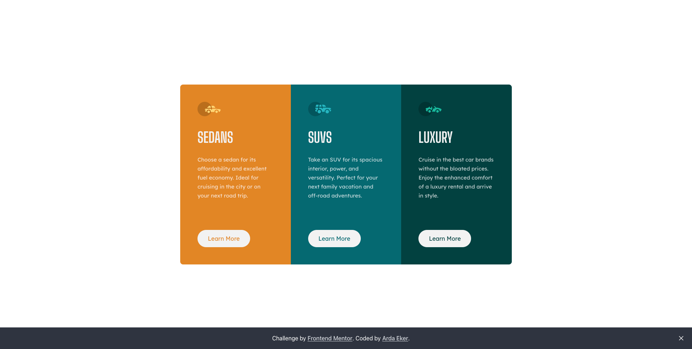
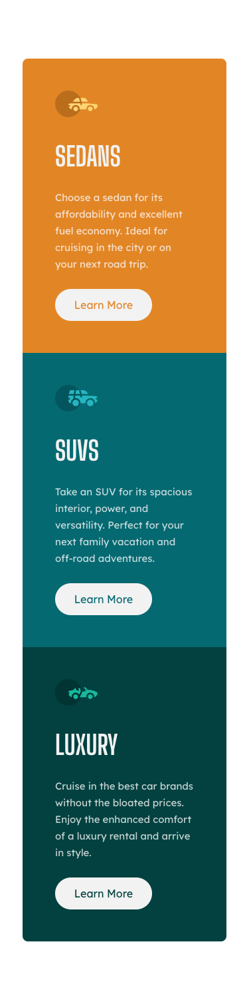

# Frontend Mentor - 3 Column Preview Card Component Solution

This is a solution to the [3-column preview card component challenge on Frontend Mentor](https://www.frontendmentor.io/challenges/3column-preview-card-component-pH92eAR2-).

## Table of contents

- [Overview](#overview)
  - [The challenge](#the-challenge)
  - [Screenshot](#screenshot)
  - [Links](#links)
  - [Built with](#built-with)
- [Author](#author)

## Overview

### The challenge

Users should be able to:

- View the optimal layout depending on their device's screen size
- See hover states for interactive elements

## Screenshot

|                  Desktop                   |
| :----------------------------------------: |
|  |

|                  Mobile                   |
| :---------------------------------------: |
|  |

## Links

- Solution URL: [Solution](https://www.frontendmentor.io/solutions/3-column-preview-card-component-c6mB22vsZT)
- Live Site URL: [Live Site](https://ardaeker-3-column-preview-card-component-solution.vercel.app)

## Built with

- Semantic HTML5 markup
- Mobile-first workflow
- [Next.js](https://nextjs.org/) - React framework
- [Tailwind CSS](https://tailwindcss.com) - For styles

## Author

- Website - [www.ardaeker.com](https://ardaeker.com)
- Frontend Mentor - [@ardaeker](https://www.frontendmentor.io/profile/ardaeker)
